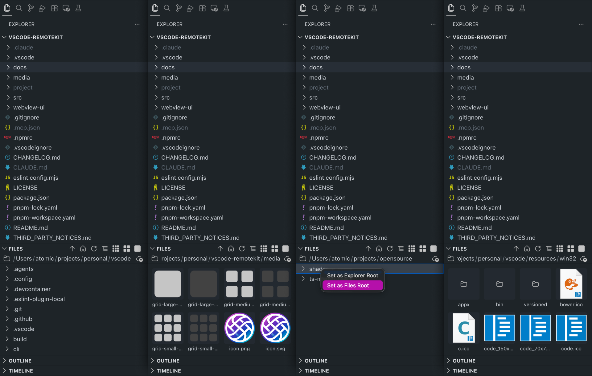

# RemoteKit

**A toolkit that makes working over Remote-SSH feel native.**

When you connect to a remote machine with VS Code's Remote-SSH extension, you open a single working directory — but the rest of the filesystem is still there, and you often need it. RemoteKit gives you first-class tools to browse, preview, and switch between remote folders without leaving your editor or losing your place.

RemoteKit runs **on the remote machine** and reads its filesystem directly, so there's nothing to configure.

## Features

### 🗂️ Remote File Explorer

A dedicated view in the Explorer sidebar that browses the remote filesystem independently of your opened workspace folder.

- Navigate anywhere the remote root can reach — system folders, other projects, shared mounts — without changing your workspace.
- A clickable **breadcrumb** path lets you re-root to any ancestor folder in one click.
- Click a folder to expand it, click a file to open it (in preview, keeping focus in the tree). Directory contents load lazily as you expand, so large trees stay responsive.
- Title-bar buttons step **up to the parent folder**, **reset to your working folder**, and **refresh**.
- Right-click a folder and choose **Set as Explorer Root** (or **Set as Files Root**) to re-root the view there.

### 🖼️ Gallery View

Switch the File Explorer into a thumbnail grid to preview assets without copying them locally.

- Three densities — **Small**, **Medium**, and **Large** — toggled from the view's title bar.
- Image files render as thumbnails; other file types fall back to their file-type glyph.
- Click a folder to drill into it; click a file to open it.

### ⬆️ Uploads

Get local files onto the remote machine straight from the Explorer.

- **Paste** files, use the **upload button** in the breadcrumb, or **hold ⇧ Shift and drag** files in from your OS.
- Name conflicts prompt you to **Overwrite**, **Keep Both**, or **Skip**.

> **Note:** Drag-and-drop requires holding **⇧ Shift** — VS Code disables sidebar webviews during ordinary drag operations for security, so the Shift modifier is what lets the drop reach RemoteKit.

## Requirements

- VS Code `1.125.0` or newer.
- The [Remote - SSH](https://marketplace.visualstudio.com/items?itemName=ms-vscode-remote.remote-ssh) extension, with an active connection to a remote host.

## Getting Started

1. Connect to a remote host with Remote-SSH as usual.
2. Open the **Explorer** sidebar — the **Files** view appears below your project tree.
3. Browse the remote filesystem, switch to a Gallery view to preview assets, and upload files with ⇧ Shift + drag.

## Roadmap

Planned features, not yet available:

- **Favourites / Shortcuts** — pin folders you visit often and keep them one click away at the top of the view.
- **Switch to Folder** — reopen your VS Code window rooted at any remote folder, keeping the same SSH connection.
- **Improved Folder Selector** — replace the stock path-typing prompt when opening a remote folder with a real, browsable picker.

## Known Issues

- Very large directories may take a moment to populate while their contents are read over the SSH connection.
- File-type icons follow VS Code's **default (Seti)** icon set and do not follow a custom file-icon theme you may have installed (a sidebar webview can't read the active icon theme).

## Release Notes

### 0.1.1

Initial public release of RemoteKit:

- **Remote File Explorer** with breadcrumb navigation, lazy loading, and re-rootable folders.
- **Gallery view** with small / medium / large thumbnail densities.
- **Uploads** via paste, the upload button, and ⇧ Shift + drag.

**Enjoy!**
